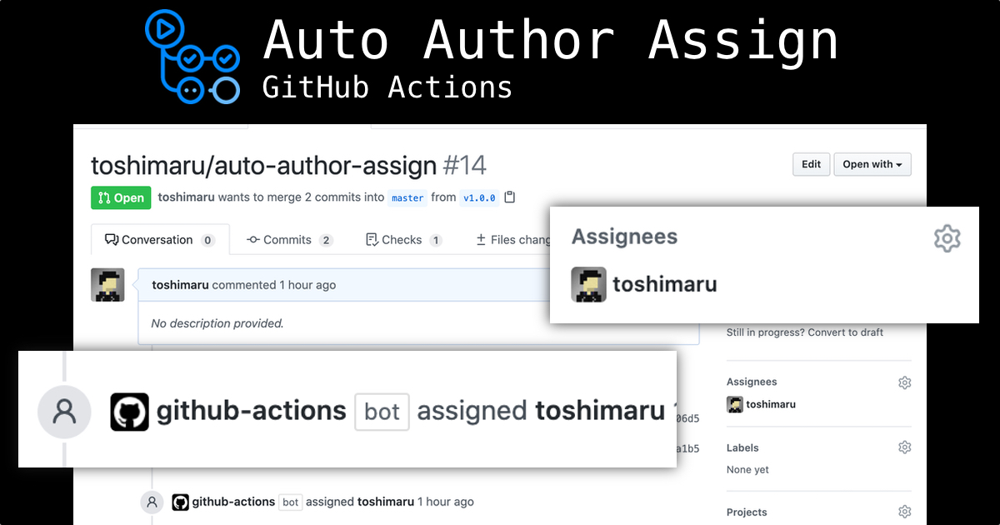

# auto-assign-prs

GitHub Actions: Assign pull request author automatically, *and also additional specified assignees*.

## Why this action?

In most cases, pull request author should be assigned an assignee of the pull request.

*You may also want to always assign someone.*

This action automatically assigns PR author *and specified people* to PRs.